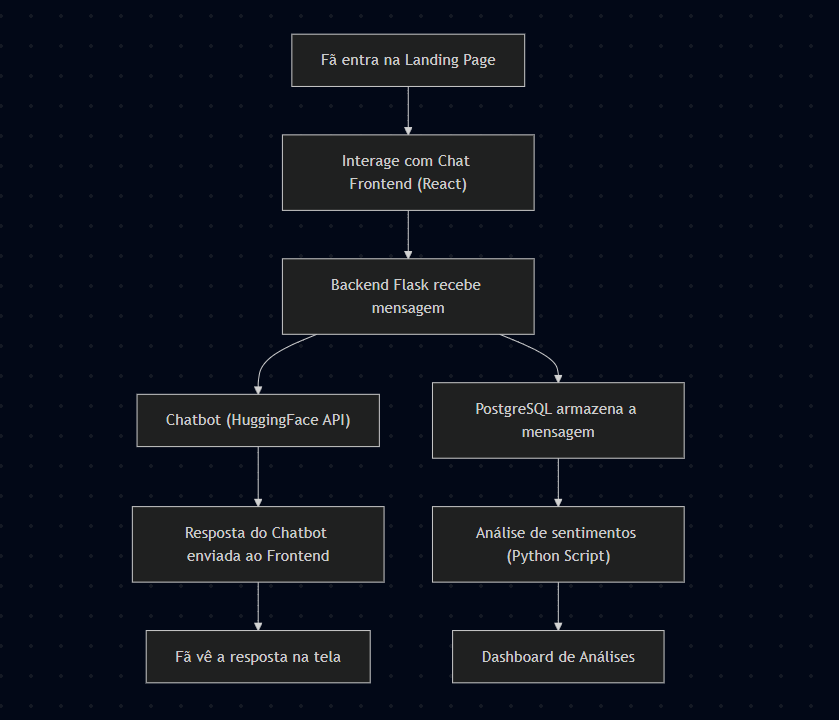

# FURIA Fan Chat — Powered by AI and Data Engineering

Bem-vindo ao projeto FURIA Fan Chat!  
Este sistema permite que fãs da FURIA interajam em tempo real, usando um chatbot inteligente gratuito e com coleta/análise de dados em PostgreSQL.

## 🛠️ Arquitetura do Sistema
O diagrama abaixo representa como o sistema é organizado:



## 📚 Tecnologias Usadas

- Front-end: React.js
- Back-end: Flask (Python)
- Banco de Dados: PostgreSQL
- IA Gratuita: Hugging Face API (chatbot) 
- Hospedagem: Vercel (Frontend) + Railway (Backend)

## 🎯 Funcionalidades

- Chat para fãs conversarem.
- Chatbot integrado para responder dúvidas sobre a FURIA.
- Armazenamento das conversas em banco de dados.
- Análise de sentimentos das mensagens.
- Dashboard de interações dos fãs.

## 🚀 Como Rodar o Projeto

### Pré-requisitos
- Node.js instalado
- Python 3.10+
- Conta gratuita no Hugging Face (ou outra API gratuita)
- Banco de dados PostgreSQL ativo (pode usar ElephantSQL gratuito)

### Passo a Passo

#### Backend (Flask)
```bash
cd backend
python -m venv venv
source venv/bin/activate # Linux/Mac
venv\Scripts\activate    # Windows
pip install -r requirements.txt
python app.py
```

#### Frontend (React)
```bash
cd frontend
npm install
npm start
```
Acesse o frontend no navegador em http://localhost:3000.

#### Variáveis de Ambiente
Crie um arquivo .env no backend com:
```bash
POSTGRES_URL=seu_banco_de_dados
HUGGINGFACE_API_KEY=sua_api_key
```

#### 📄 Licença
Este projeto é livre para fins educacionais.

Desenvolvido com 💜 para o processo seletivo FURIA Tech.
